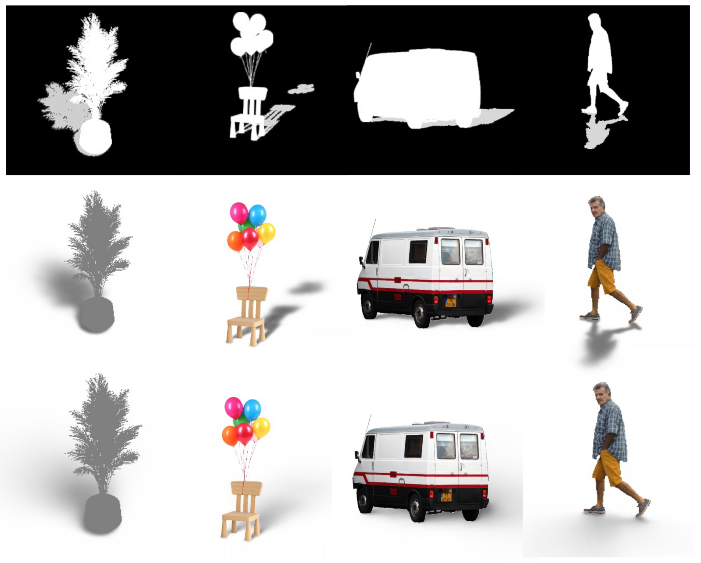

# SSN: Soft Shadow Network for Image Composition (CVPR 2021 Oral)


[Paper](https://openaccess.thecvf.com/content/CVPR2021/papers/Sheng_SSN_Soft_Shadow_Network_for_Image_Compositing_CVPR_2021_paper.pdf)

## Preparation 
Remember to recursively git clone this repository. 
```Bash
git clone --recurse-submodules -j8 https://github.com/ShengCN/SSN_SoftShadowNet.git
```


## Data Render
The renderer for the data is in `Data` folder. This renderer is accelerated by CUDA. The computation time will be proportional to final image dimension and triangle numbers. 

### Environment Requirements
* System: Ubuntu 18.04
* CMake: >= 3.8
* GCC: >= 7.4.0
* CUDA (Ensure CMake can find nvcc)

CMake is used to manage the packages and compiling. All other dependencies required except CUDA are in the `data/src/Dep` folders. Again, remember to recursively clone the submodules. 

There is a pre-compiled Ubuntu(18.04) version in `data/src/build` folder. If you cannot run the `data/src/build/run.sh` script, then you need to recompile. 

### (Optional) Recompile 
```Bash
cd data/src/build
rm -r CMake*
cmake ..
make -j16
```

### Command Interface
1. Change directory to Data/src
2. Put obj/off files to models folder 
3. Check the parameters in the render.sh, e.g. gpus(support multiple gpu), random pitch range, random model rotation?

``` Bash
# File render.sh
model_root="models"
cache="Dataset/human_data/cache"
start_id=0
end_id=-1 # -1 means all models
width=512
height=512
cpus=6
out_hdf5="Dataset/human_data/all_base.hdf5"
cam_pitch_min=0
cam_pitch_max=45
model_rot_min=-90
model_rot_max=90
samples=2

rm tmp/scene_cache.bin

python render.py --cpus=$cpus --gpus 0 2 --model_root=$model_root --out_folder=$cache --start_id=$start_id --end_id=$end_id --width=$width --height=$height --samples=$samples --cam_pitch_min=$cam_pitch_min --cam_pitch_max=$cam_pitch_max --model_rot_min=$model_rot_min --model_rot_max=$model_rot_max &&
python build_hdf5.py --cache=$cache --width=$width --height=$height --out_hdf5=$out_hdf5
```
4. Run ./render.sh
The output will be a hdf5 file, which composed of all the data. The file structure for this hdf5: 

``` Bash
x/scene_name          # Input for training    
rgb/scene_name        # Rendered RGB for testing
base_32_8/scene_name  # Shadow base in 32 x 8 IBL resolution. 
base_64_16/scene_name # Shadow base in 64 x 16 IBL resolution
```
To see how to use this hdf5 file, please refer to *Train/datasets/SSN_Dataset.py*.

## Training
We prepared a training script. After rendering the dataset, please modify the **hdf5_file** entry in *Train/configs/ssn.yaml* accordingly. Run *Train/train.sh* will begin the training for SSN.

### Bonus
I implemented a general training framework in the *Train/* folder. It is YAML driven. The minimal work to use this framework for your experiment is to write a dataloader and define the model architectures. 

### About 
# License
SSN may be used non-commercially, meaning for research or evaluation purposes only. 

# Citation
```
@inproceedings{sheng2021ssn,
  title={SSN: Soft shadow network for image compositing},
  author={Sheng, Yichen and Zhang, Jianming and Benes, Bedrich},
  booktitle={Proceedings of the IEEE/CVF Conference on Computer Vision and Pattern Recognition},
  pages={4380--4390},
  year={2021}
}
```
